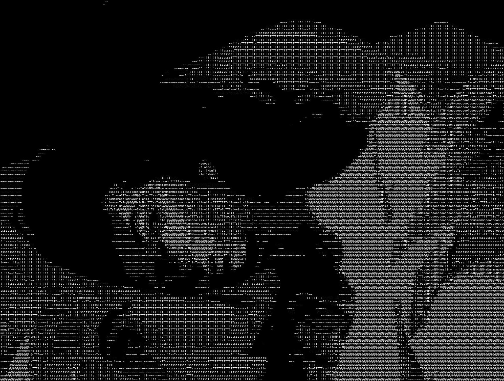
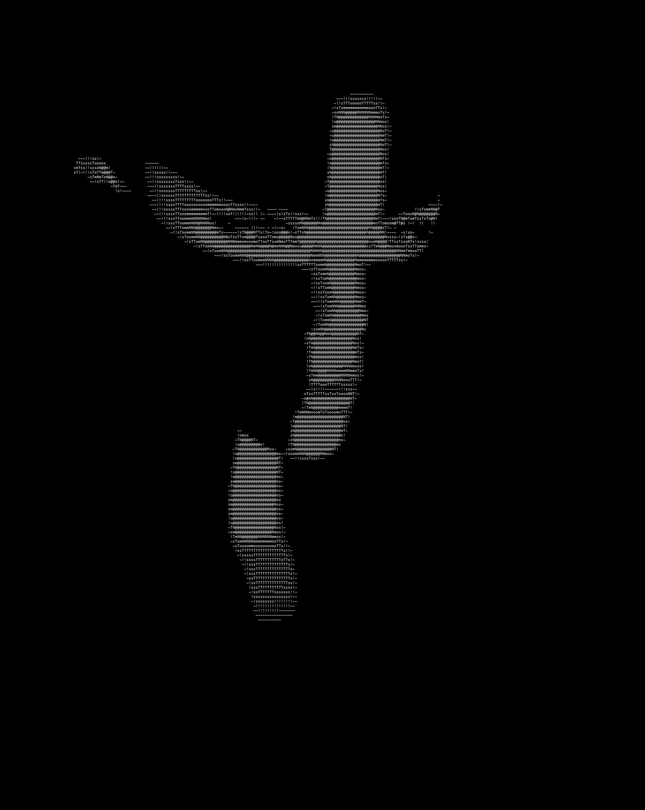
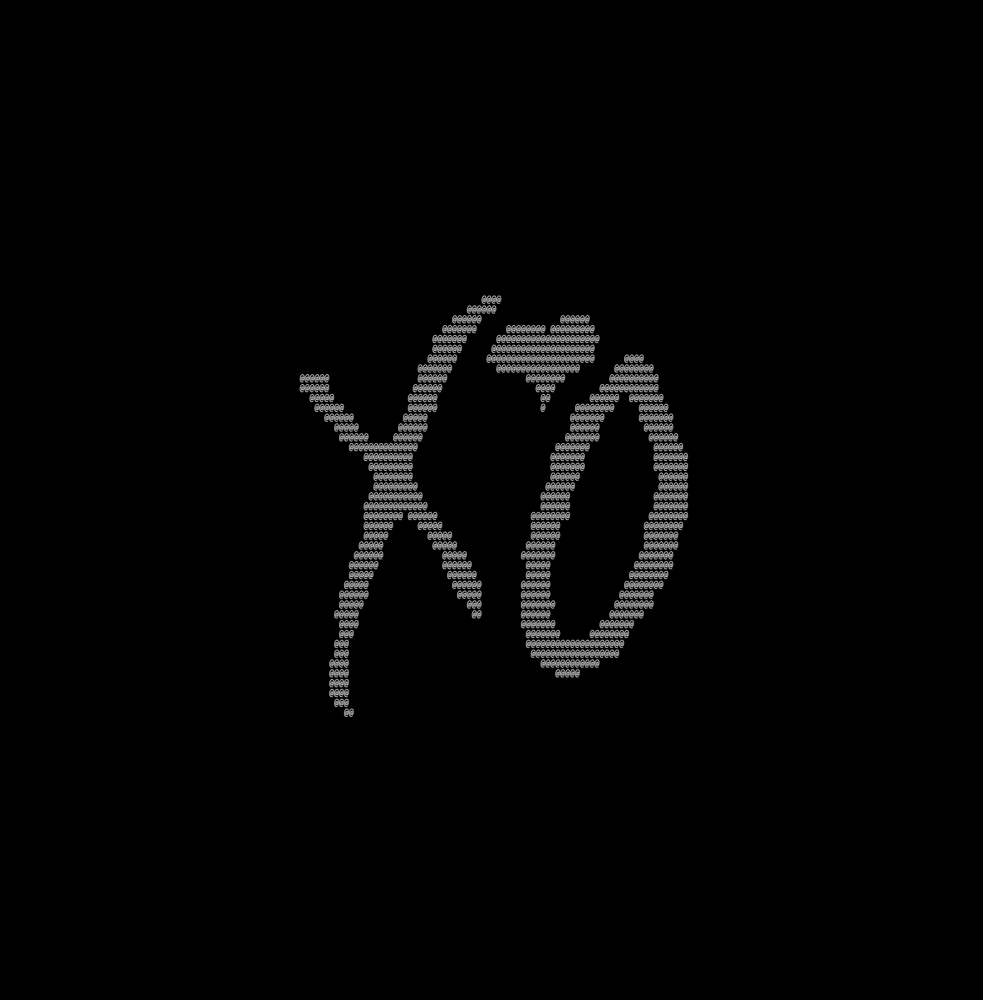

# Textify Images With Python Pillow

[](https://python-pillow.org/)

## Contents

- [Installation](#installation)
- [Usage](#usage)
  - [Turning Image to ASCII](#turning-image-to-ascii)
  - [Save ASCII as Text File](#save-ascii-as-text-file--t---text)
  - [Save ASCII as Image File](#save-ascii-as-image-file--i---image)
  - [Size](#size--s---size)
  - [Histogram Pixel Cutoff](#histogram-pixel-cutoff-&-contrast--c---cutoff)
  - [Color Quantization](#color-quantization--q---quantize)
  - [Inversion](#inversion---invert)
  - [Image Background](#image-background---white-bg)
  - [Transparent Background](#transparent-Background---transparent)
  - [Y-Shrink](#y-shrink---y-shrink)
  - [ASCII characters](#ascii-characters---chars)
  - [Font Size, Line Spacing and Font Face](#font-size---font-size-line-spacing---line-spacing-and-font-face---font-face)
- [Resolving the Font Issue](#resolving-the-font-issue)
- [Examples](#examples)

## Installation

### Clone The Repository

```code
git clone https://github.com/millionhz/textify.git
```

### Install Requirements

```code
pip install pillow
```

## Usage

```code
Textify Images With Python

positional arguments:
  image                 image to textify

optional arguments:
  -h, --help            show this help message and exit
  -s VALUE, --size VALUE
                        number of characters in a line (default: 110)
  -c VALUE, --cutoff VALUE
                        histogram pixel cutoff percentage (default: 3)
  -q VALUE, --quantize VALUE
                        number of colors to quantize the image into (default: 255)
  -t FILE, --text FILE  name of text output file
  -i FILE, --image FILE
                        name of image output file
  -clh LOW HIGH, --cutoff-low-high LOW HIGH
                        low and high value for contrast (Check: PIL.ImageOps.autocontrast) (--clh wil override -c)
  --random              randomize characters while producing image (use for binary images)
  --invert              invert the provided image
  --white-bg            use white background for output image (use black color for text)
  --transparent         make a transparent output image
  --chars STRING        ascii character list to use (default: ' `~!sTomN@')
  --font-size VALUE     font size for image output
  --line-spacing VALUE  line spacing for image output (default: 5)
  --font-face TTF_FILE  font face for image output (default: consola.ttf)
  --y-shrink VALUE      input image y-axis shrink factor (default: 1.99999)
  --sharpen VALUE       Number of sharpen filters (default: 0)
  --alt                 use alternative font settings (for mac or linux)
```

### Turning Image to ASCII

Turn images to ascii by providing the file path to the image.

```code
python textify.py art.jpg
```

### Save ASCII as Text File (-t, --text)

Save the generated image ASCII to a text file with the `-t` argument along with a name for the text file.

```code
python textify.py art.jpg -t myascii.txt
```

### Save ASCII as Image File (-i, --image)

Save the generated ASCII in an image file with the `-i` argument along with a name for the output image.

```code
python textify.py art.jpg -i myart.jpg
```

### Size (-s, --size)

Specify the number of ascii characters in one line with the `-s` argument.

```code
python textify.py art.jpg -s 300 -i myart.jpg
```

Each pixel is converted to an ascii character so the width of the image is equal to the length of a string of ascii characters. The `-s` argument must be used when making images. The larger the size the more detailed and realistic the produced image will be but the file size will be larger and the ascii characters will seem smaller.

Recommended range for `-s` argument : < 600


### Histogram Pixel Cutoff & Contrast (-c, --cutoff)

Control the contrast by specifying the pixel cutoff percentage from either side of the histogram with the `-c` argument.

```code
python textify.py art.jpg -c 6
```
You can also specify the cutoff percentage of either side of histogram separately with the `-clh` argument.
```code
python textify.py art.jpg -clh 20 6
```
NOTE: `-clh` will override `-c`.

Check [PIL.ImageOps.autocontrast()](https://pillow.readthedocs.io/en/stable/reference/ImageOps.html?#PIL.ImageOps.autocontrast) to learn more.


### Color Quantization (-q, --quantize)

Control the quantization of the input image by specifying the number of colors to quantize the input image into with the `-q` argument.

```code
python textify.py art.jpg -q 2
```


### ASCII characters (--chars)

Specify the ASCII characters to use in the textified image with `--chars` argument.

If you want to produce an image with only " " (blank space) and "@" use:

```code
python textify.py art.jpg --chars " @"
```

NOTE: It is important to use the " " (double quotes) or otherwise the blank space character will not be recognized.

Specify the characters from the darkest to the lightest one.

The program is designed to work with terminals and text editors with black backgrounds. If your terminal or text editor has a white background, use the [`--invert`](<#Inversion (--invert) And Image Background (--white-bg)>) argument to invert the image for optimal results.

### Inversion (--invert)

Invert the input image with the `--invert` argument.

The program is build to work with black backgrounds by default, which means that the darkest ASCII character is " " (blank space), which will let the black background completely pass through. This will increase the contrast of the produced image.

If you are using a terminal with white background or the background where you are going to post the produced text is white, you'll need to use the `--invert` argument. The argument will invert the image and thus reverse the mapping of the ASCII characters.

```code
python textify.py art.jpg --invert
```

### Image Background (--white-bg)

By default the images produced with the `-i` argument will have a black background. To produce an image with a white background use the `--white-bg` argument.

```code
python textify.py art.jpg --invert --white-bg -i myart.jpg
```

NOTE: As the program is for black backgrounds as discussed in [inversion](#inversion---invert) above, you should use the `--invert` and `--white-bg` argument together, unless you want to produce an inverted image.


### Transparent Background (--transparent)

Make images with transparent background with the `--transparent` command.

```code
python textify.py art.jpg --transparent -i myart.png
```

Make sure to use `.png` in the output file name.

### Y-Shrink (--y-shrink)

Control the vertical shrink of the input image by specifying the factor by which to shrink it with the `--y-shrink` argument.

```code
python textify.py art.jpg --y-shrink 1.74
```

ASCII characters are padded so when an image is turned into ASCII, it seems stretched. The amount of stretching depends on the font face and the line spacing. To reverse this the input image is shrunk by a specific factor beforehand.

### Font Size (--font-size), Line Spacing (--line-spacing) and Font Face (--font-face)

The `--font-size`, `--line-spacing` and `--font-face` arguments work together and should be used when the produced ASCII is saved as an image using the `-i` argument.

`--font-size` argument can be used to change the font size of the ASCII characters.

`--line-spacing` argument can be used to change the spacing between lines.

`--font-face` argument can be used to change the font face.

```code
python textify.py art.jpg --font-size 12 --line-spacing 5 --font-face "consola.ttf" -i myart.jpg
```

IMPORTANT:

- Only use **monospace fonts** or otherwise the produced image will not look proportional.

- The `--font-size` and `--line-spacing` (and in some cases `--y-shrink`) must be changed together in order to conserve the aspect ratio of the produced image.

## Resolving The Font Issue

The program was made on windows and was calibrated to work with the Microsoft's Consolas Font Family but that font can not be redistributed due to licensing issues. This means that the program will not work properly on Linux and Macs. You can learn more about this [here](https://docs.microsoft.com/en-us/typography/fonts/font-faq).

However, Inconsolata-Regular is included in the repository as an alternative open source font but it needs its own `--line-spacing` and `--y-shrink` settings.

You can use the command below to generate your images with the Inconsolata-Regular font:

```code
python textify.py --alt -i <name of output image> <input image to textify>
```

Or if you want to tweak some settings yourself you can use the recommended settings for Inconsolata-Regular font from the command below:

```code
python textify.py --font-face font/Inconsolata-Regular.ttf --chars " `~!1f2d@" --line-spacing 1 --y-shrink 2 -i <name of output image> <input image to textify>
```

You can download the Inconsolata Font Family [here](https://fonts.google.com/specimen/Inconsolata).

## Examples









